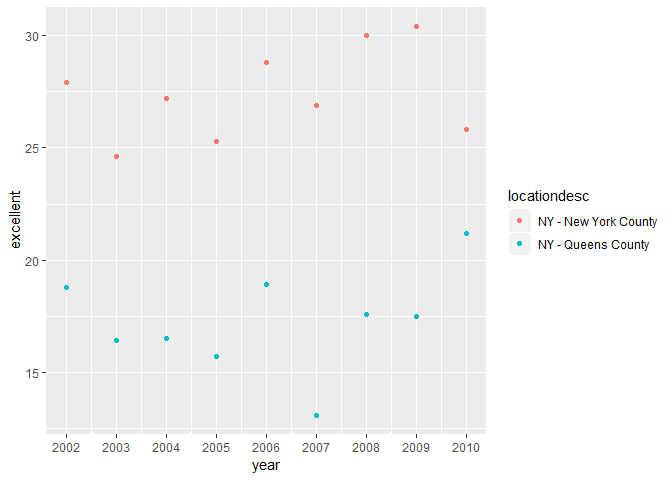

Homework 2 - Reinforces Ideas in Data Wrangling 1
================
Vincent Tam
October 2, 2018

Problem 1 - NYC Subway Stations
-------------------------------

### About this Dataset

The original dataset contained a number of variables that concern the details of the NYC Subway System's stations:
1. Division 2. Train Line
3. Station Location Name
4. Station Latitude
5. Station Longitude
6. Route Numbers or Letters Served
7. Entrance Type
8. Presence of Entry
9. Presence of Exit
10. Presence of Vending
11. Presence of Staffing
12. Staff Hours
13. ADA Compliance
14. ADA Notes
15. Presence of Free Crossovers
16. North-South Streets
17. East-West Streets
18. Corner Location
19. Station Location (Latitude/Longitude)
20. Entrance Location (Latitude/Longitude)

The "cleaned" dataset, so far has removed all variables except:
1. Line
2. Station Name
3. Station Location (Latitude/Longitude)
4. Routes Served
5. Presence of Entry
6. Presence of Vending
7. Entrance Type
8. ADA compliance.

Data "cleaning" of the original dataset used the functions "janitor" to clean column names for conversion to lower snake case and "select" to retain desired variables. The "Presence of Entry" variable was converted from character to logical via the "mutate" and "recode" functions.

The dataset should not be considered "tidy". Routes are not consolidated but spread across eleven different columns.

The dimension of the cleaned dataset is 1868 rows by 19 columns.

There are 465 distinct subway stations.

There are 84 distinct stations that are ADA compliant.

0.0374732 is the proportion of station entrances/exits without vending allow entrances.

60 distinct stations serve the A train.

17 A train stations are ADA compliant.

Problem 2 - Mr Trash Wheel
--------------------------

### About the Datasets

There are two separate but related datasets in this problem set. The first dataset is about Mr. Trash Wheel cleaning the Baltimore Harbor of man-made refuse. Data in the excel file includes dates, number of dumpster-worth of trash collected, volume and weight of collected garbage, counts of a variety of most common man-made debris collected, and the amount of energy the trash wheel collected in terms of "homes powered" (each ton of trash = approximately 500 kilowatts of electricity and an average home uses 30 kilowatts/day). The dataset contains 216 rows by 14 columns of data after cleaning and omission of rows that did not include dumpster-specific data and columns containing notes.

Although there are other calendar years of data available, only the precipitation datasets for 2016 and 2017 were utilized here. Precipitation data for those two years were cleaned by omitting rows without precipitation data. The datasets were combined and the variable for month was converted to a character variable. There are 12 rows by 3 columns of data for year 2016. Year 2017 has 12 rows by 3 columns of data. Datasets for both years contained details of total inches of percipitation per calendar month in a year.

Total precipitation in 2017 was 32.93 inches.

Median number of sports balls collected per dumpster in 2016, rounded to the nearest integer was 26.

Problem 3 - BRFFS Data
----------------------

There are 51 unique locations included in this dataset. Every state and the District of Columbia appear to be represented here. The state that appears to be most observed in this dataset is NJ with a total of 146 observations.

In 2002, the median of the “Excellent” response value was 23.6.

### Plots

#### Histogram of Excellent Response Values in 2002

#### Scatterplot of Proportion of Excellent Response Values in New York County and Queens County in Each Year from 2002 to 2010.

